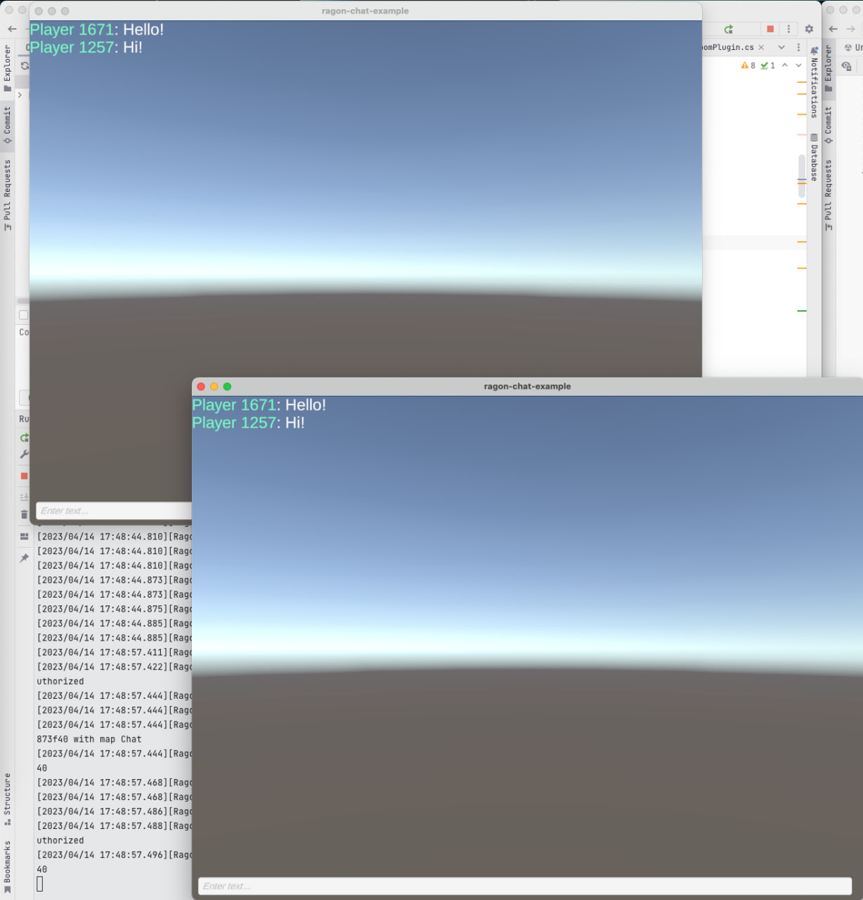

# Ragon Simple Chat

### Requirements:
- Unity 2021.2.x
- Ragon Server v1.2.1-rc

### Get started

1) Download server [Ragon Relay v1.2.1-rc](https://github.com/edmand46/Ragon/releases/tag/v1.2.1-rc)
2) Unpack and run Ragon.Relay(.exe for win)
3) Open project with Unity and Play!

### Screenshot

